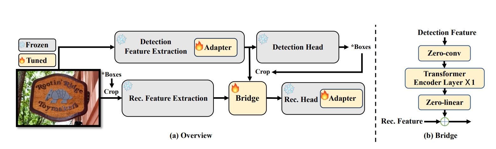

## Introduction

This is a PyToch implementation trained jointly by DBNet and CRNN through the Bridge structure. Through the Bridge structure, the recognizer and detector can be connected to improve detection performance while maintaining modularity.

## Main Results

**Total-Text:**

| Method  | Det-P | Det-R | Det-F | E2E-P | E2E-R | E2E-F |
| :-----: | :---: | :---: | :---: | :---: | :---: | :---: |
| DB-CRNN | 0.79  | 0.60  | 0.68  | 0.72  | 0.55  | 0.62  |

## reference

* [Bridge](https://arxiv.org/pdf/2404.04624)

* [DBnet](https://arxiv.org/pdf/1911.08947)

* [CRNN](https://arxiv.org/abs/1507.05717)

  
